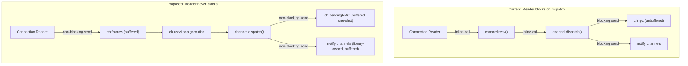

<!-- 9991c3a8-b830-4aca-a549-2ab495793a19 -->
---
todos:
  - id: "part1-channel-struct"
    content: "Part 1: Modify Channel struct -- remove recv/rpc, add frames/pendingRPC/state fields, add recvLoop goroutine, update newChannel and shutdown"
    status: pending
  - id: "part1-state-machine"
    content: "Part 1: Update recvMethod/recvHeader/recvContent to use ch.state assignment instead of transition()"
    status: pending
  - id: "part1-dispatchN"
    content: "Part 1: Update Connection.dispatchN to non-blocking send to channel.frames with overflow protection"
    status: pending
  - id: "part2-call-oneshot"
    content: "Part 2: Rewrite Channel.call() to use per-RPC one-shot buffered channel via ch.pendingRPC"
    status: pending
  - id: "part2-dispatch-default"
    content: "Part 2: Update dispatch() default case to non-blocking send to ch.pendingRPC"
    status: pending
  - id: "part3-call-context"
    content: "Part 3: Add context.Context to Channel.call() with close-on-timeout semantics"
    status: pending
  - id: "part3-public-api"
    content: "Part 3: Add context.Context to all public Channel methods, remove XxxWithContext duplicates"
    status: pending
  - id: "part3-connection-api"
    content: "Part 3: Add context.Context to Connection.Channel, Connection.Close, Connection.UpdateSecret, remove CloseDeadline"
    status: pending
  - id: "part4-notify-signatures"
    content: "Part 4: Change all Notify* methods to return library-owned buffered channels, remove NotifyConfirm"
    status: pending
  - id: "part4-nonblocking-sends"
    content: "Part 4: Make all sends to notify/error channels non-blocking (select/default) in dispatch, shutdown, confirms"
    status: pending
  - id: "part5-update-tests"
    content: "Part 5: Update client_test.go, connection_test.go, examples_test.go, example_client_test.go for new API"
    status: pending
  - id: "part5-new-tests"
    content: "Part 5: Add new tests for context timeout, frame overflow, non-blocking shutdown"
    status: pending
  - id: "part5-integration-tests"
    content: "Part 5: Update integration_test.go for new API signatures"
    status: pending
  - id: "part5-examples"
    content: "Part 5: Update _examples/ directory for new API"
    status: pending
  - id: "part6-docs"
    content: "Part 6: Update doc.go with new API patterns and context semantics"
    status: pending
isProject: false
---
# Fix Channel Deadlocks via Architecture Redesign

Fixes: [#253](https://github.com/rabbitmq/amqp091-go/issues/253), [#225](https://github.com/rabbitmq/amqp091-go/issues/225)

Breaking changes are allowed.

## Architecture Overview

## Part 1: Per-channel goroutine

Decouple the connection reader from channel frame processing.

### `channel.go` - Channel struct changes

- Remove field `recv func(*Channel, frame)` and `rpc chan message`
- Add field `frames chan frame` (buffered, cap 64) and `pendingRPC chan message` (nil when idle)
- Rename `recv` state tracking to `state func(*Channel, frame)`
- Add `recvLoop()` method that ranges over `ch.frames` and calls `ch.state(ch, f)`
- In `newChannel()`: initialize `frames: make(chan frame, 64)`, launch `go ch.recvLoop()`
- In `shutdown()`: call `close(ch.frames)` early to stop the goroutine

### `channel.go` - State machine functions

- `transition()` replaced by direct `ch.state = ...` assignments
- `recvMethod`, `recvHeader`, `recvContent` unchanged in logic, just assign `ch.state` instead of calling `ch.transition()`

### `connection.go` - `dispatchN` changes

- Replace inline `channel.recv(channel, f)` with non-blocking send to `channel.frames`
- Add `select/default` overflow protection: if buffer full, close channel asynchronously with an overflow error

### `types.go` - `updateChannel`

- Move the `updateChannel(f, channel)` call to happen before sending to `channel.frames`, still under `c.m.Lock()` (no change needed, already correct)

## Part 2: Per-RPC one-shot response channel

Replace the shared `ch.rpc` with per-call buffered channels.

### `channel.go` - `call()` changes

- Each invocation creates `reply := make(chan message, 1)` and stores it in `ch.pendingRPC` under `ch.m.Lock()`
- `defer` clears `ch.pendingRPC` (only if it's still pointing to `reply`)
- Select on `reply`, `ch.errors`, and `ctx.Done()` (Part 3)

### `channel.go` - `dispatch()` default case

- Replace `ch.rpc <- msg` with: read `ch.pendingRPC` under lock, non-blocking send to it
- If `pendingRPC` is nil (nobody waiting), discard the message

### `connection.go` - `c.rpc` stays

- The Connection-level `c.rpc` channel is used for connection handshake and is fine as-is. No changes to `Connection.call()`, `dispatch0`, or `reader`.

## Part 3: Context support with close-on-timeout

### `channel.go` - `call()` signature

- Change to `call(ctx context.Context, req message, res ...message) error`
- On `case <-ctx.Done()`: launch `go ch.connection.closeChannel(ch, ...)` and return `ctx.Err()`

### `channel.go` - Public method signature changes

Every public RPC method gets `ctx context.Context` as first parameter. Remove old non-context variants and merge `XxxWithContext` duplicates.

Methods to change (all in `channel.go`):

- `Close(ctx context.Context) error` (was `Close() error`)
- `Qos(ctx, prefetchCount, prefetchSize, global)`
- `Cancel(ctx, consumer, noWait)`
- `QueueDeclare(ctx, name, durable, autoDelete, exclusive, noWait, args)`
- `QueueDeclarePassive(ctx, ...)`
- `QueueInspect(ctx, name)`
- `QueueBind(ctx, name, key, exchange, noWait, args)`
- `QueueUnbind(ctx, name, key, exchange, args)`
- `QueuePurge(ctx, name, noWait)`
- `QueueDelete(ctx, name, ifUnused, ifEmpty, noWait)`
- `Consume(ctx, queue, consumer, autoAck, exclusive, noLocal, noWait, args)` -- replaces both `Consume` and `ConsumeWithContext`
- `ExchangeDeclare(ctx, ...)`, `ExchangeDeclarePassive(ctx, ...)`
- `ExchangeDelete(ctx, ...)`, `ExchangeBind(ctx, ...)`, `ExchangeUnbind(ctx, ...)`
- `Publish(ctx, ...)` -- replaces both `Publish` and `PublishWithContext`. Context gates entry, not RPC.
- `PublishWithDeferredConfirm(ctx, ...)` -- replaces `PublishWithDeferredConfirmWithContext`
- `Get(ctx, queue, autoAck)`
- `Tx(ctx)`, `TxCommit(ctx)`, `TxRollback(ctx)`
- `Flow(ctx, active)`
- `Confirm(ctx, noWait)`
- `Recover(ctx, requeue)`

Methods removed entirely:
- `PublishWithContext` -- merged into `Publish`
- `PublishWithDeferredConfirmWithContext` -- merged into `PublishWithDeferredConfirm`
- `ConsumeWithContext` -- merged into `Consume`

### `channel.go` - `open()` signature

- Change to `open(ctx context.Context) error`

### `connection.go` - `Channel()` and `openChannel()`

- `Channel(ctx context.Context) (*Channel, error)` -- passes ctx to `ch.open(ctx)`
- `openChannel(ctx context.Context)` -- passes ctx through

### `connection.go` - `Connection.Close`, `UpdateSecret`

- `Close(ctx context.Context) error` -- replaces `Close()`. `CloseDeadline` removed (context subsumes it).
- `UpdateSecret(ctx, newSecret, reason)` -- context support

## Part 4: Non-blocking library-owned notification channels

### `channel.go` - `Notify*` methods

Change signatures to return library-allocated, buffered, receive-only channels:

- `NotifyClose() <-chan *Error` -- allocates `make(chan *Error, 1)`, returns it
- `NotifyFlow() <-chan bool` -- allocates `make(chan bool, 1)`
- `NotifyReturn() <-chan Return` -- allocates `make(chan Return, 1)`
- `NotifyCancel() <-chan string` -- allocates `make(chan string, 1)`
- `NotifyPublish() <-chan Confirmation` -- allocates `make(chan Confirmation, 32)`

Remove `NotifyConfirm` entirely (users should use `NotifyPublish` and branch on `Confirmation.Ack`).

### `connection.go` - `Notify*` methods

- `NotifyClose() <-chan *Error` -- allocates `make(chan *Error, 1)`
- `NotifyBlocked() <-chan Blocking` -- allocates `make(chan Blocking, 1)`

### `channel.go` and `connection.go` - Non-blocking sends everywhere

All sends to notification channels become non-blocking `select/default`:

- `channel.go` `dispatch()`: flows, cancels, returns cases
- `channel.go` `shutdown()`: closes, errors sends
- `connection.go` `shutdown()`: closes, errors sends
- `connection.go` `dispatch0()`: blocks (connectionBlocked/Unblocked) sends
- `confirms.go` `confirm()`: listener sends (line 64-66)

## Part 5: Update tests

### `client_test.go`

- `TestNotifyClosesReusedPublisherConfirmChan` -- remove (tests `NotifyConfirm` which is removed)
- `TestNotifyClosesAllChansAfterConnectionClose` -- update: `Notify*` calls return channels instead of accepting them
- `TestChannelReturnsCloseRace` -- update: `NotifyReturn` returns channel
- `TestChannelOpen`, `TestOpenClose_ShouldNotPanic` -- add `context.Background()` to `c.Channel()`, `c.Close()`
- `TestConfirmMultipleOrdersDeliveryTags` -- update `NotifyPublish` call, `Confirm` call, `Publish*` calls with ctx
- `TestDeferredConfirmations` -- same
- `TestPublishBodySliceIssue74`, `TestPublishZeroFrameSizeIssue161`, `TestPublishAndShutdownDeadlockIssue84` -- update `Publish*` calls with ctx
- `TestLeakClosedConsumersIssue264` -- update `Consume`, `Qos`, `Channel`, `Close` calls with ctx

### `connection_test.go`

- Update all `c.Channel()` calls to `c.Channel(ctx)`
- Update `c.Close()` calls to `c.Close(ctx)`

### `examples_test.go`

- Update all example functions: `Notify*` calls, `Channel()`, `Close()`, `Publish*`, `Consume`, `ExchangeDeclare`, `QueueDeclare`, `QueueBind`, `Confirm`, `Cancel`, `Qos` -- all get ctx param
- Remove `ExampleConnection_NotifyBlocked` or update signature

### `example_client_test.go`

- Update `NotifyClose`, `NotifyPublish`, `Channel`, `Close`, `QueueDeclare`, `Publish*` calls

### `_examples/` directory

- `_examples/client/client.go` -- update all API calls
- `_examples/pubsub/pubsub.go` -- update all API calls
- `_examples/producer/producer.go` -- update all API calls
- `_examples/consumer/consumer.go` -- update all API calls

### New tests

- `TestCallContextTimeout` -- verify `call()` returns `context.DeadlineExceeded` and channel is closed
- `TestDispatchNOverflow` -- verify frame buffer overflow closes the channel
- `TestShutdownNonBlocking` -- verify `shutdown()` completes even with no notify listeners

### `integration_test.go`

- Update all `Notify*`, `Channel`, `Close`, `Consume`, `Publish*`, `QueueDeclare`, `QueueBind`, `ExchangeDeclare`, `Qos`, `Confirm`, `Cancel` calls with ctx

## Part 6: Update documentation

### `doc.go`

- Update examples to use new `Notify*` return signatures
- Remove warnings about buffered channels (library handles it now)
- Document context semantics: timeout/cancel closes the AMQP channel
- Remove references to `PublishWithContext` (now just `Publish`)
